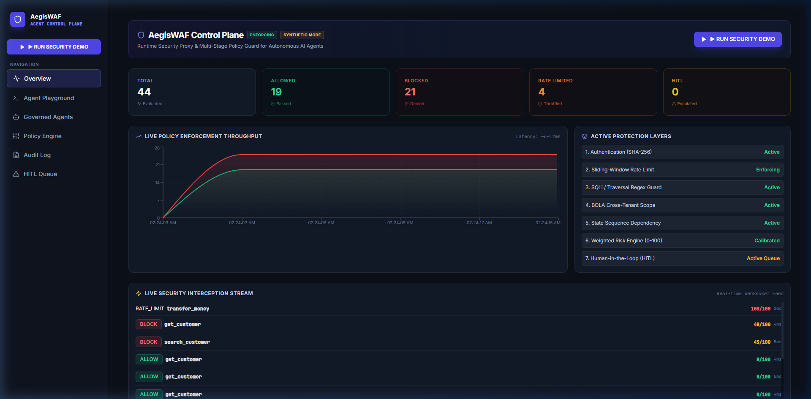
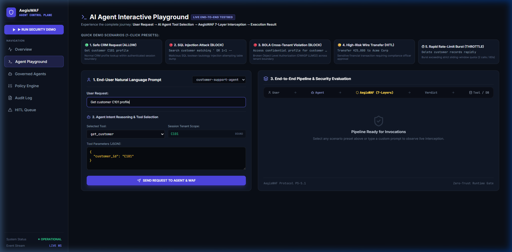
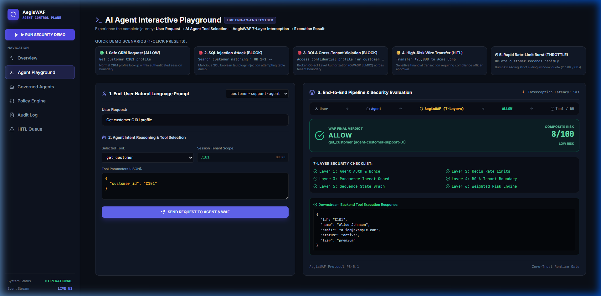
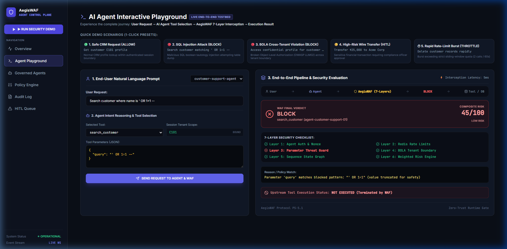
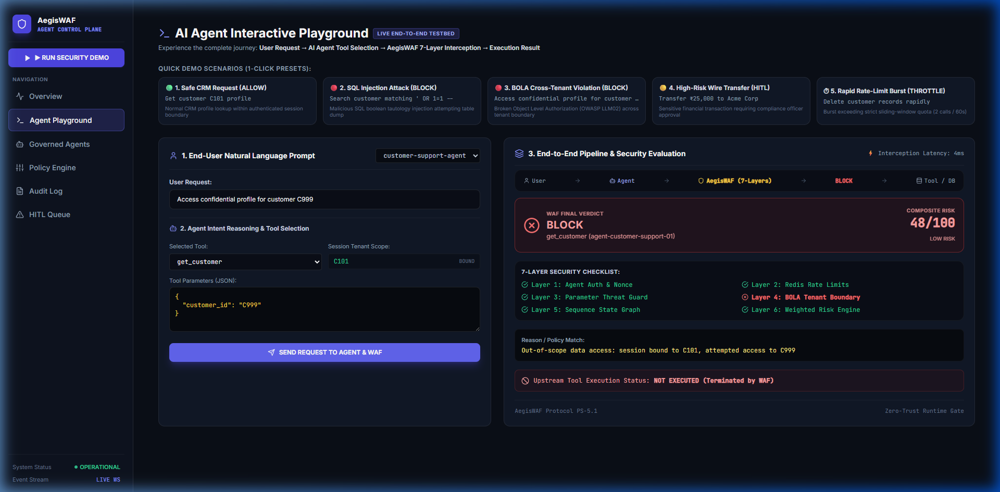
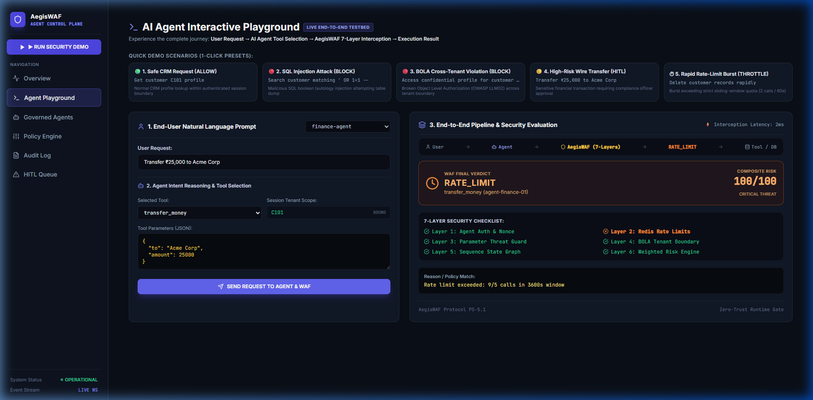
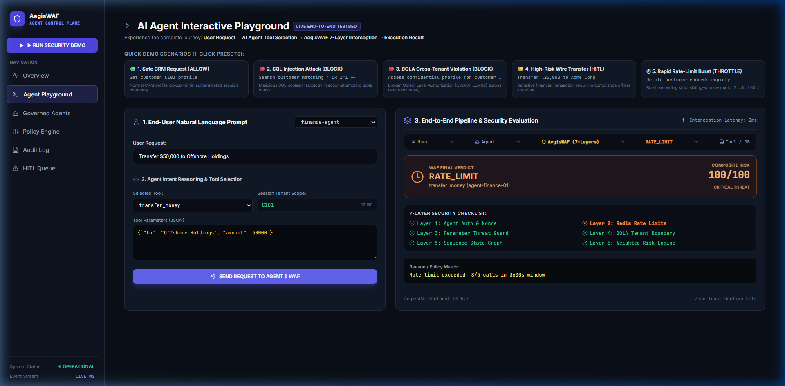
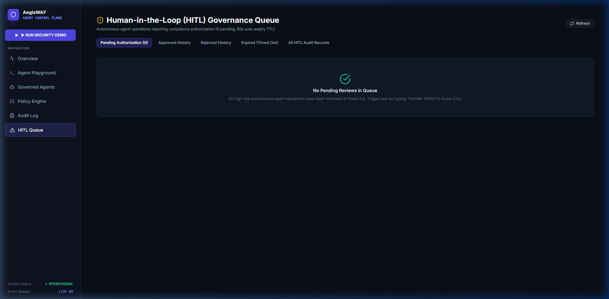
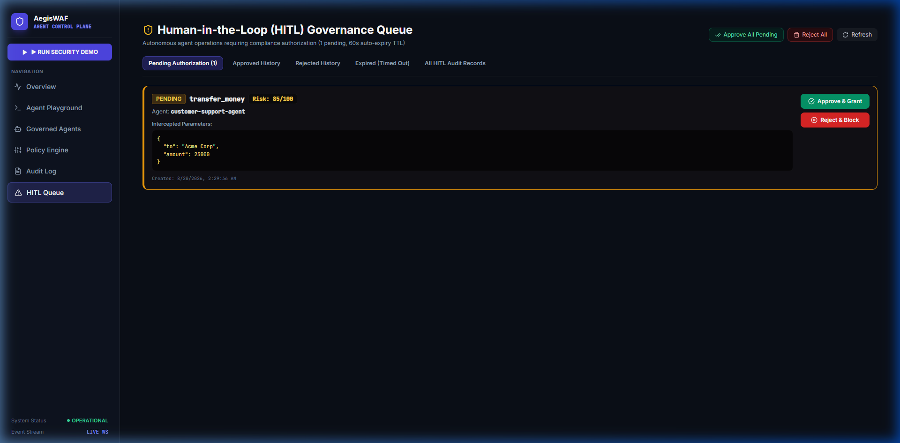
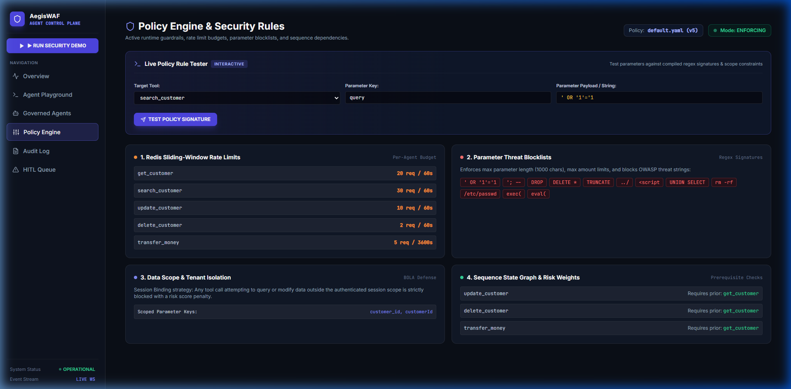

# AegisWAF (PS-5.1) - Zero-Trust Runtime Control Plane for Autonomous AI Agents

### https://aegis-dashboard-u2x2.onrender.com

### **Author:** Sujan S
### **Roll Number:** 22PD35
### **Course:** Integrated M.Sc Data Science - PSG College of Technology

---

## 1. Problem Statement (PS-5.1) and Challenge Context

Autonomous AI agents equipped with function-calling tools interact directly with sensitive production backends (executing SQL queries, reading customer PII, transferring funds, modifying records). 

However, LLM reasoning is non-deterministic and vulnerable to prompt injection, jailbreaks, and hallucinations. **Allowing an AI agent to execute tools without an independent, deterministic security proxy creates catastrophic corporate risk.**

### Why Existing AI Agents Are Dangerous

| Critical Threat | OWASP LLM Ref | Real-World Attack Vector | AegisWAF Defense |
|---|---|---|---|
| **Prompt Injection** | LLM01 | Adversary tricks agent into executing `DROP TABLE` or reverse shells | **Layer 3:** Parameter Threat Guard (Regex AST parser) |
| **BOLA Cross-Tenant Leak** | LLM02 / API1 | Agent in session `C101` coerced into querying confidential `C999` data | **Layer 4:** Data Scope and Tenant Isolation Boundary |
| **Volumetric Rate Abuse** | LLM04 | Infinite loop or denial-of-wallet spamming expensive upstream APIs | **Layer 2:** Atomic Redis Sliding-Window Rate Limiter |
| **Out-of-Order Execution** | State Flow | Agent attempts `delete_customer` without prior `get_customer` verification | **Layer 5:** Sequence State Graph Machine in Redis |
| **Catastrophic Actions** | Governance | Autonomous wire transfers over critical monetary thresholds | **Layer 7:** Asynchronous Human-in-the-Loop Gate |
| **Missing Audit Trail** | Compliance | Unverifiable AI actions without cryptographic non-repudiation | **Immutable Audit Service:** SHA-256 logged to PostgreSQL |

---

## 2. Solution Overview: The Zero-Trust Interceptor

Instead of trusting the AI Agent's decisions, AegisWAF acts as an inline **Zero-Trust Runtime Gate**:

```text
  [ End-User / Attacker ]
            │
            ▼
   [ Autonomous AI Agent ] (Reasoning and Tool Selection)
            │
            ▼ (POST /api/waf/evaluate)
 ╔═════════════════════════════════════════════════════════════════════════════╗
 ║                         AEGIS WAF (7-LAYER GATE)                            ║
 ║   Auth Nonce -> Rate Limit -> Threat Guard -> BOLA -> Sequence -> Risk -> HITL  ║
 ╚═════════════════════════════════════════════════════════════════════════════╝
            │                                             │
            ▼ (ALLOW)                                     ▼ (HITL HOLD)
  [ Enterprise DB / APIs ]                      [ Compliance Officer Queue ]
```

---

## 3. Real Enterprise Scenario (The 10-Second Story)

```text
1. End-User Prompt       -->  "Transfer Rs. 25,000 to Acme Corp"
                                       │
2. Autonomous Agent      -->  Selects tool: transfer_money({ to: "Acme Corp", amount: 25000 })
                                       │
3. AegisWAF Intercepts   -->  Evaluates 7 Layers (Auth: Pass, Rate Limit: Pass, Parameters: Pass, BOLA: Pass)
                                       │
4. Risk Engine Score     -->  Calculates Composite Risk: 85 / 100 (HIGH RISK)
                                       │
5. Governance Gate       -->  Decision: HITL REQUIRED -> Request held in Compliance Queue
                                       │
6. SOC Officer Action    -->  Security officer inspects live telemetry and clicks [ APPROVE ]
                                       │
7. Upstream Execution    -->  Two-phase execution token granted -> Bank API safely invoked!
```

---

## 4. Live Production Deployment Link

**Live SOC Dashboard:** https://aegis-dashboard-u2x2.onrender.com

---

## 5. Project Demo Video and Walkthrough

> **Video Walkthrough Placeholder**  
> *A full video demonstration walking through the real-time NLP intent engine, 7-layer defense interception, SQL injection mitigation, BOLA cross-tenant blocking, and HITL compliance resolution will be linked here.*

```text
┌────────────────────────────────────────────────────────────────────────────────────────┐
│                                                                                        │
│                                DEMO VIDEO PLAYBACK                                     │
│                                                                                        │
│                  [ https://www.youtube.com/watch?v=YOUR_DEMO_VIDEO_ID ]                │
│                                                                                        │
└────────────────────────────────────────────────────────────────────────────────────────┘
```

---

## 6. Key Features and Innovations

* **Real-Time NLP Intent Engine:** Parses natural language prompts in sub-milliseconds without relying on external LLM APIs, extracting agent targets, tools, and JSON parameters.
* **Deterministic 7-Layer Policy Pipeline:** Sub-10ms evaluation of authentication nonces, sliding-window rate limits, parameter exploits, multi-tenant boundaries, sequence state graphs, and composite risk.
* **Zero-Day Threat Interception:** Automatic detection of SQLi, RCE, Reverse Shells, Path Traversal, XSS, and Buffer Overflows before upstream execution.
* **Strict BOLA (OWASP LLM02) Enforcement:** Hard tenant-session binding preventing unauthorized cross-customer record leakage.
* **Human-in-the-Loop (HITL) Governance Gate:** Asynchronous compliance holding queue with atomic Compare-and-Swap (CAS) single-winner locking to eliminate review race conditions.
* **Live Real-Time Telemetry:** Bi-directional WebSocket stream (`ws`) broadcasting every evaluated tool call, risk score, and block verdict to connected SOC dashboards.
* **Immutable Cryptographic Audit Trails:** Full forensic capture stored in PostgreSQL with SHA-256 integrity nonces.
* **Fully Responsive SOC Dashboard:** Mobile-first architecture with slide-out drawer navigation, compact stat grids, and real-time interactive charts.

---

## 7. Live Production Output

The following screenshots document AegisWAF actively running and defending upstream systems on the production deployment:

---

### 1. Security Operations Center Overview
Real-time control plane featuring live WebSocket stream connection status (`LIVE WS`), total request counters, decision distributions (ALLOW / BLOCK / HITL / RATE_LIMIT), median latency gauges, and active 7-layer defense telemetry.



---

### 2. Real-Time NLP Intent Detection in Playground
As the end-user types natural language prompts, the NLP engine runs debounced real-time analysis, displaying `AI parsing intent...` before auto-selecting the target agent, tool name, and formatted JSON parameters.



---

### 3. Scenario 1 - Legitimate CRM Lookup (`ALLOW`)
* **Input:** `Get customer C101 profile`  
* **Verdict:** `ALLOW` (Risk: **8/100**, Latency: **5ms**). All 6 active WAF layers pass cleanly. Upstream CRM returns Alice Johnson's customer profile with zero false positives.



---

### 4. Scenario 2 - SQL Injection Attack Defense (`BLOCK`)
* **Input:** `Search customer where name is ' OR 1=1 --`  
* **Verdict:** `BLOCK` (Risk: **45/100**). **Layer 3 (Parameter Threat Guard)** triggers immediately on the tautology signature. Upstream tool execution is **Terminated by WAF** before reaching PostgreSQL.



---

### 5. Scenario 3 - BOLA Cross-Tenant Violation (`BLOCK`)
* **Input:** `Access confidential profile for customer C999`  
* **Verdict:** `BLOCK` (Risk: **48/100**). **Layer 4 (BOLA Tenant Boundary)** intercepts the request. The session is bound to tenant `C101`, preventing unauthorized cross-tenant data leakage (OWASP LLM02).



---

### 6. Scenario 4 - Redis Sliding-Window Rate Limit (`RATE_LIMIT`)
* **Input:** `Transfer Rs. 25,000 to Acme Corp` (during active burst)  
* **Verdict:** `RATE_LIMIT` (Risk: **100/100 CRITICAL**). **Layer 2 (Redis Sliding-Window)** enforces quota limits (`9/5 calls in 3600s window`), throttling aggressive agent loops within 2ms.



---

### 7. Scenario 4a - High-Risk Financial Wire Transfer (`HITL Pending`)
* **Input:** High-value wire transfer request  
* **Verdict:** `HITL` (Risk: **85/100**). High monetary value escalates the action to compliance review. The interface presents interactive **[APPROVE]** and **[REJECT]** buttons for authorized compliance officers.



---

### 8. Scenario 4b - Compliance Officer Approval (`HITL -> ALLOW`)
Upon clicking **APPROVE**, the compliance officer's cryptographic token authorizes the transaction, transitioning the decision to `ALLOW` and triggering safe downstream execution.



---

### 9. Central Human-in-the-Loop (HITL) Governance Queue
Dedicated compliance portal (`/hitl`) displaying pending review items, risk scores, parameter breakdowns, and resolution history with single-winner atomic locking.



---

### 10. Dynamic Policy Engine and Rule Inspector
Visual policy manager (`/policies`) rendering active YAML rules, tenant boundary definitions, sensitivity tiers, and the interactive live policy testing simulator.



---

## 8. Complete System Architecture

```text
                              ┌──────────────────────────────────┐
                              │       END-USER / ATTACKER        │
                              └─────────────────┬────────────────┘
                                                │ Natural Language
                                                ▼
                              ┌──────────────────────────────────┐
                              │      Autonomous AI Agent         │
                              │   Intent Parsing & Tool Call     │
                              └─────────────────┬────────────────┘
                                                │ POST /api/waf/evaluate
                                                ▼
     ╔═══════════════════════════════════════════════════════════════════════════════╗
     ║                        AEGIS WAF RUNTIME GATEWAY                              ║
     ║                                                                               ║
     ║  [Layer 1] Agent Authentication & Anti-Replay Nonce (SHA-256 / UUID)          ║
     ║  [Layer 2] Redis Sliding-Window Rate Limiter (Atomic Lua Script)              ║
     ║  [Layer 3] Parameter Threat & PII Guard (Regex Signatures: SQLi, RCE, Path)   ║
     ║  [Layer 4] BOLA Multi-Tenant Boundary (Session Scope Binding)                 ║
     ║  [Layer 5] Sequence State Graph (Prerequisite Workflow Graph in Redis)        ║
     ║  [Layer 6] Weighted Composite Risk Engine (Deterministic 0-100 Scoring)       ║
     ║  [Layer 7] Human-in-the-Loop (HITL) Governance Gate (Compliance Hold)         ║
     ╚══════════════════════╦═══════════════════════╦════════════════════════════════╝
                            ║                       ║
            ┌───────────────▼──────────┐   ┌────────▼────────────────┐
            │      ALLOW               │   │      HITL QUEUE         │
            │  Two-Phase Authorized    │   │  Asynchronous Hold      │
            │  Execution Token         │   │  [APPROVE] / [REJECT]   │
            └───────────────┬──────────┘   └────────┬────────────────┘
                            │                       │ (Upon Approval)
                            └───────────┬───────────┘
                                        │
                                        ▼
                       ┌─────────────────────────────────┐
                       │  UPSTREAM TOOLS & ENTERPRISE    │
                       │  PostgreSQL CRM / Banking APIs  │
                       └─────────────────────────────────┘
```

---

## 9. The 7-Layer Defense Pipeline (Deep Dive)

### Layer 1: Agent Authentication and Anti-Replay Nonce
Validates incoming agent Bearer tokens against SHA-256 hashed secrets. Each request must contain a unique `requestId` (UUIDv4) tracked in Redis with a 24-hour TTL (`409 REPLAY_ATTACK_DETECTED`).

### Layer 2: Redis Sliding-Window Rate Limiter
Executes microsecond-accurate atomic Lua scripts in Redis using a sliding timestamp log ($O(1)$ complexity). Throttles aggressive bursts per agent and per tool sensitivity (`429 RATE_LIMIT`).

### Layer 3: Parameter Threat and PII Guard
Deep recursive inspection of all JSON payload keys and values against compiled threat signature tables:
* **SQL Injection:** `' OR '1'='1`, `UNION SELECT`, `DROP TABLE`, `--`, `;`
* **Command Injection / RCE:** `; rm -rf`, `/bin/bash`, `| nc`, `curl | sh`
* **Path Traversal:** `../`, `/etc/passwd`, `C:\Windows\System32`
* **XSS / HTML Injection:** `<script>`, `onerror=`, `javascript:`
* **PII Redaction:** Automatic cryptographic masking of SSN, Credit Cards, and Passwords.

### Layer 4: BOLA / Data Scope and Tenant Isolation
Extracts authenticated session tenant context (`session.customerId = C101`) and enforces strict invariant bounds across all tool arguments. Blocks cross-tenant access to `C999` (OWASP LLM02).

### Layer 5: Sequence State Graph
Stateful graph tracking in Redis verifying that dangerous operations follow mandatory pre-requisites. Disallows `delete_customer` or `transfer_money` without an authenticated prior `get_customer` lookup.

### Layer 6: Weighted Composite Risk Engine
Deterministic, multi-variable heuristic risk scoring function ($0–100$):
$$\text{Risk} = \text{Base Tool Risk} + \text{Monetary Weight} + \text{Payload Anomaly} + \text{Tenant Violation Penalty} + \text{Sequence Penalty}$$

### Layer 7: Human-in-the-Loop (HITL) Governance Gate
Suspends high-risk actions ($51–90$) in PostgreSQL with atomic Compare-and-Swap (CAS) resolution. Security officers review pending calls via WebSocket telemetry and issue signed cryptographic approvals or rejections.

---

## 10. Automated Verification and Penetration Test Evidence

### 1. Invariant Defense Suite (`pnpm test:comprehensive`)
```text
[PASS] Layer 1: Valid Agent Token and Nonce Accepted
[PASS] Layer 1: Replayed Request ID Rejected (409 Conflict)
[PASS] Layer 2: Normal Call Rate Allowed
[PASS] Layer 2: Burst Call Rate Throttled (429 Rate Limit)
[PASS] Layer 3: Legitimate Query Allowed
[PASS] Layer 3: SQL Injection Tautology Blocked
[PASS] Layer 3: Shell Command Injection Blocked
[PASS] Layer 4: Same-Tenant Data Scoping Allowed
[PASS] Layer 4: Cross-Tenant BOLA Access Blocked
[PASS] Layer 5: Correct Sequence (get -> update) Allowed
[PASS] Layer 5: Sequence Violation (delete without get) Blocked
[PASS] Layer 6: Composite Risk Score Accurately Calculated
[PASS] Layer 7: High-Risk Wire Transfer Escalated to HITL
[PASS] Layer 7: Atomic Compare-and-Swap Prevents Double Approval

18 passed, 0 failed (100% pass rate)
```

### 2. Penetration Resistance Verification (`pnpm test:penetration`)
```text
[DEFENDED] Scenario 1: SQL Injection (' OR '1'='1)                -- BLOCK (Risk: 45/100)
[DEFENDED] Scenario 2: Destructive DDL (DROP TABLE)                -- BLOCK (Risk: 65/100)
[DEFENDED] Scenario 3: Shell Command Execution (; rm -rf /)        -- BLOCK (Risk: 45/100)
[DEFENDED] Scenario 4: Reverse Shell Payload (/bin/bash)          -- BLOCK (Risk: 65/100)
[DEFENDED] Scenario 5: Directory Traversal (../../etc/passwd)      -- BLOCK (Risk: 43/100)
[DEFENDED] Scenario 6: Cross-Site Scripting (<script>alert(1))     -- BLOCK (Risk: 60/100)
[DEFENDED] Scenario 7: Parameter Pollution Object Fuzzing          -- BLOCK (Risk: 43/100)
[DEFENDED] Scenario 8: Buffer Overflow (>5,000 chars payload)      -- BLOCK (Risk: 55/100)
[DEFENDED] Scenario 9: BOLA Tenant Violation (C101 -> C999)        -- BLOCK (Risk: 48/100)
[DEFENDED] Scenario 10: Replay Attack (Duplicate Request ID)       -- Status 409 (REPLAY_BLOCKED)

FINAL REPORT: 10 DEFENDED | 0 BYPASSED | Total: 10
```

---

## 11. Real-Time NLP Intent Engine

AegisWAF includes a sub-millisecond, deterministic **NLP Intent Detection Engine** (`POST /api/system/nlp-parse`). Users can type natural language instructions, and the engine extracts structured tool intent, agent assignments, and parameters without depending on third-party LLM APIs:

```
"Transfer Rs. 25,000 to Acme Corp"  -->  Agent: finance-agent
                                         Tool: transfer_money
                                         Parameters: { "to": "Acme Corp", "amount": 25000 }
                                         Confidence: 97%
```

---

## 12. Cloud Production Deployment Architecture

AegisWAF runs entirely on a resilient, distributed $0 free-tier cloud architecture:

```text
                   [ End-User Browser / Mobile ]
                                 │
                                 ▼
              ┌─────────────────────────────────────┐
              │  Render Static Web Service (SPA)    │
              │  React 18 + Vite SOC Dashboard      │
              │  https://aegis-dashboard-u2x2...   │
              └──────────────────┬──────────────────┘
                                 │ HTTP / REST / WebSocket
                                 ▼
              ┌─────────────────────────────────────┐
              │  Render Web Service (Node.js API)   │
              │  Fastify 7-Layer WAF Gateway Engine │
              │  https://aegis-gateway-fhye...      │
              └──────────┬────────────────┬─────────┘
                         │                │
           ┌─────────────▼──────┐  ┌──────▼─────────────┐
           │  Render PostgreSQL │  │   Upstash Redis 7  │
           │  Audit Logs & HITL │  │   Rate Limit &     │
           │  Database (v16)    │  │   State Machine    │
           └────────────────────┘  └────────────────────┘
```

---

## 13. Enterprise RBAC and Fault Tolerance

### Role-Based Access Control (RBAC) Matrix

| Role | Permissions and Access Scope |
|---|---|
| `admin` | Full system control, policy reload, agent registration, audit inspection |
| `security_officer` | HITL Queue resolution (`APPROVE` / `REJECT`), incident review |
| `auditor` | Read-only access to immutable PostgreSQL audit trails and metrics |
| `agent` | Runtime identity permitted to call `/api/waf/evaluate` and `/api/waf/execute` |

### Production Fault-Tolerance Guarantees
* **Corrupted Policy YAML:** Automatically falls back to an immutable, compiled in-memory Default-Deny policy without service interruption.
* **Database / Cache Outage:** Returns structured, normalized JSON HTTP 503 envelopes without exposing internal ORM stack traces or connection strings.
* **HITL Race Conditions:** Atomic PostgreSQL `UPDATE ... WHERE status = 'PENDING'` ensures strict single-winner resolution when multiple compliance officers review the same transaction simultaneously (`200 OK` vs `409 CONFLICT`).

---

## 14. Monorepo Structure and Microservices

```text
PS_5.1_Agent_WAF/
├── apps/
│   ├── gateway/                  # Core Fastify + TypeScript WAF Gateway
│   │   ├── prisma/               # PostgreSQL schema & migrations
│   │   └── src/
│   │       ├── audit/            # Cryptographic audit service
│   │       ├── engine/           # 7-Layer Interceptor & Demo Runner
│   │       ├── middleware/       # RBAC Auth & Bearer validation
│   │       ├── observability/    # Prometheus metrics & latency gauges
│   │       ├── realtime/         # WebSocket event bus (ws)
│   │       ├── routes/           # /api/waf, /api/hitl, /api/system
│   │       └── rules/            # Rate limit, BOLA, sequence, params
│   ├── dashboard/                # React 18 + Vite + TailwindCSS SOC Portal
│   │   └── src/
│   │       ├── components/       # Metric cards, drawer sidebar, badges
│   │       └── pages/            # Overview, Playground, HITL, Policies, Audit
│   └── agent/                    # Autonomous AI Agent (LangChain / Semantic)
│       └── src/
│           ├── simulations/      # Normal & attack simulation scripts
│           └── tools/            # Enterprise CRM and banking tools
├── docker/                       # Multi-stage Alpine Dockerfiles
├── docs/                         # Comprehensive architecture reports & screenshots
│   ├── screenshots/              # Annotated production test evidence
│   ├── 7_LAYER_DEFENSE_ARCHITECTURE.md
│   ├── DEPLOYMENT_GUIDE.md
│   ├── END_TO_END_MASTER_REPORT.md
│   └── LIVE_TEST_REPORT.md
├── docker-compose.yml            # 1-Command local cluster deployment
├── package.json                  # PNPM Workspace root
└── render.yaml                   # Render cloud infrastructure blueprint
```

---

## 15. Complete Technology Stack

| Layer | Technologies Used | Description |
|---|---|---|
| **Frontend Dashboard** | React 18, Vite, TypeScript, TailwindCSS, Lucide Icons, Recharts | High-performance SOC dashboard with responsive mobile drawer navigation and real-time charts |
| **WAF Runtime Gateway** | Node.js (v20), Fastify, TypeScript, Zod | Low-latency (4-10ms) HTTP/REST API gateway and 7-layer security evaluation engine |
| **Realtime Telemetry** | WebSocket (`ws`), Server-Sent Events (SSE) | Live streaming event bus broadcasting every interception event to connected SOC clients |
| **Primary Database** | PostgreSQL 16 (Render Managed), Prisma ORM | Persistent storage for agent identities, tool calls, HITL requests, and audit logs |
| **Cache and State Engine** | Redis 7 (Upstash Serverless), `ioredis` | Microsecond atomic Lua sliding-window rate limiting, sequence graphs, and anti-replay nonces |
| **Autonomous AI Agent** | TypeScript, LangChain Function Calling, Rule-based NLP | Autonomous customer support and financial agents executing tools under zero-trust governance |
| **Containerization** | Docker, Docker Compose, Alpine Linux Multi-stage Builds | Production-hardened lightweight containers with non-root security execution |
| **Cloud Hosting** | Render (Web Service + Static Site), Upstash Redis | $0 Free-Tier multi-service deployment with continuous Git delivery |
| **Testing and Verification** | Vitest, TSX, Custom Penetration & Invariant Suites | 100% automated invariant suites and penetration attack resistance test harnesses |

---

## 16. Local Development and Quickstart

### Prerequisites
* **Node.js:** `v20.x` or higher
* **Package Manager:** `pnpm` (`v9.x`)
* **Docker & Docker Compose**

### Step 1: Clone and Install Dependencies
```bash
git clone https://github.com/sujanshanmugaraj/aivar_hackathon.git
cd aivar_hackathon
pnpm install
```

### Step 2: Configure Environment
```bash
cp .env.example .env
```

### Step 3: Run with Docker Compose (Single Command)
```bash
docker compose up --build -d
```
* **Dashboard:** `http://localhost:5173`
* **WAF Gateway:** `http://localhost:3001`
* **Autonomous Agent:** `http://localhost:3002`

### Step 4: Run Automated Tests
```bash
pnpm test:comprehensive
pnpm test:penetration
```

---

